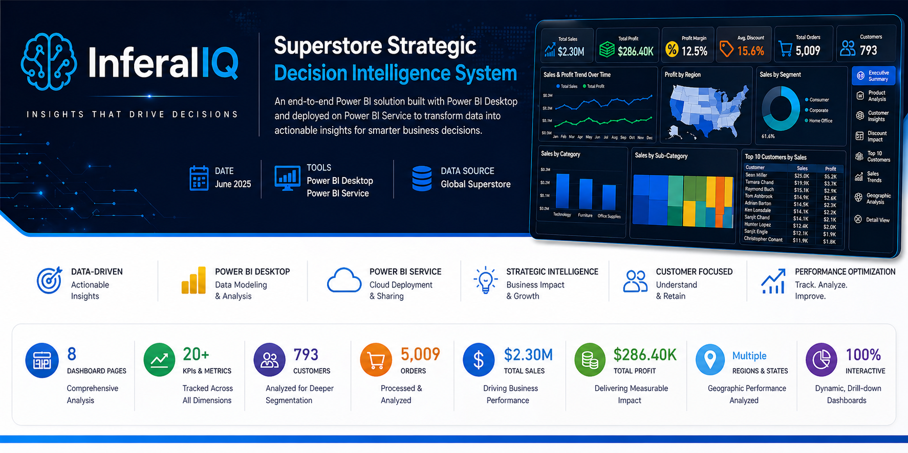
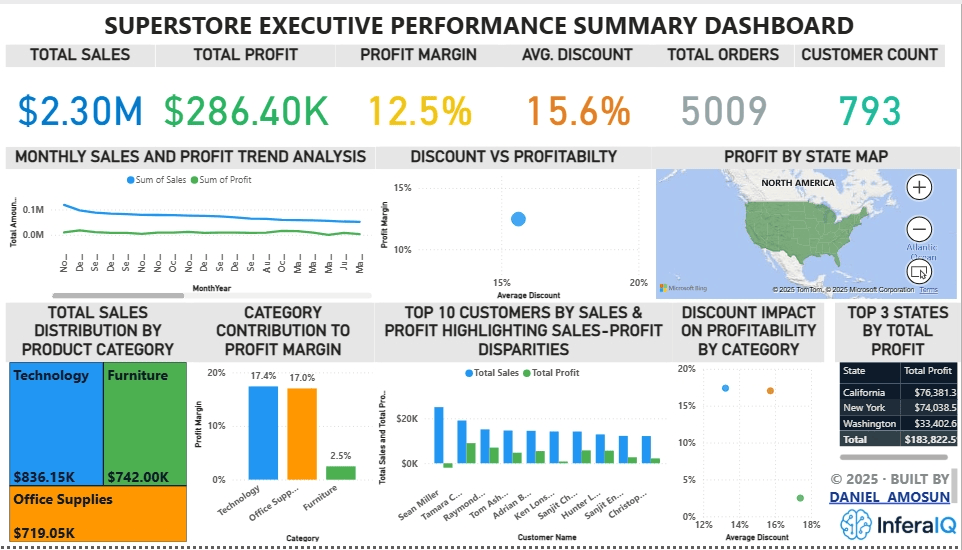
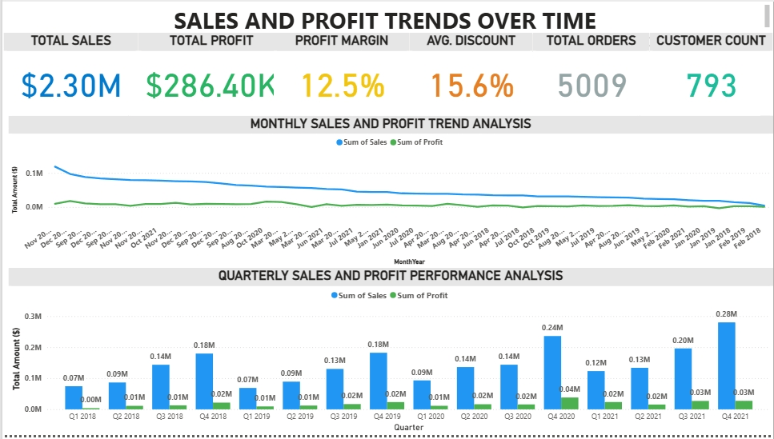
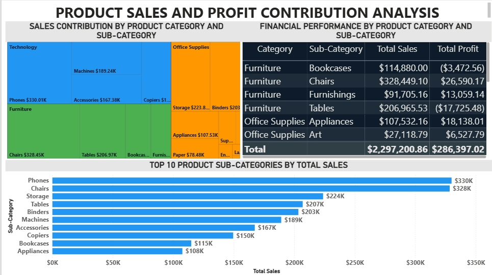
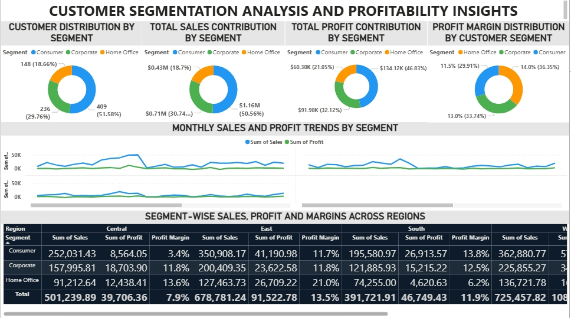
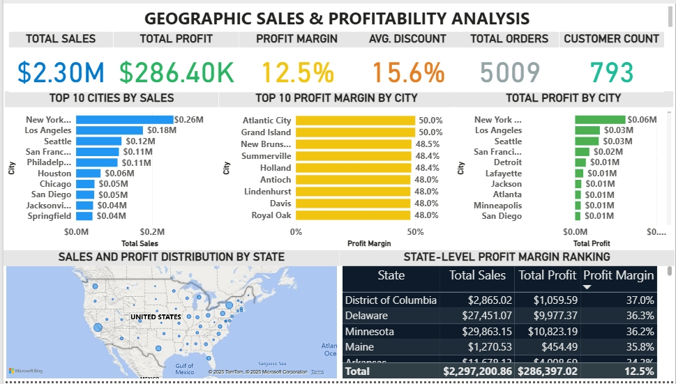
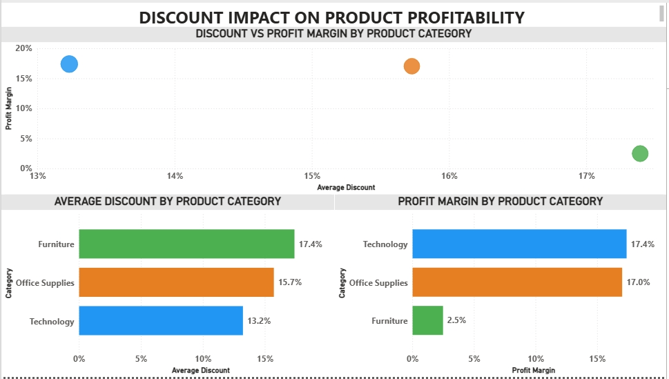
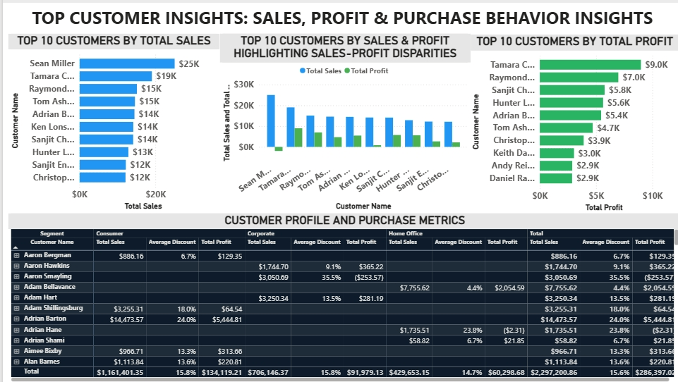
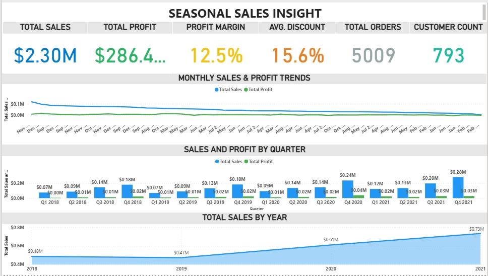

# 📊 Superstore Strategic Insights Dashboard

**End-to-End Power BI Analytics Solution for KPI-Driven Retail Decision-Making**

---

## 📌 Project Overview

This project presents a structured business intelligence solution developed in Power BI, transforming raw transactional data from the Global Superstore dataset into decision-ready insights.

The dashboard suite enables comprehensive analysis of sales performance, profitability, customer behaviour, and regional trends, supporting data-driven decision-making.

---

## 🎯 Business Objectives

- Identify top-performing product categories and sub-categories  
- Analyse regional and segment-level profitability  
- Evaluate the impact of discounting on profit margins  
- Identify high-value customers and purchasing behaviour  
- Detect seasonal sales patterns across time  
- Highlight underperforming markets and optimisation opportunities  

---

## 📊 Key Metrics

- Total Sales  
- Total Profit  
- Profit Margin (%)  
- Order Volume  
- Customer Segment Performance  
- Regional & State-Level Performance  

---

## 🛠 Tools & Technologies

- Power BI Desktop  
- Power BI Service  
- DAX (Data Analysis Expressions)  
- Data Modelling  
- Data Cleaning & Transformation  

---

## 📊 Dashboard Suite Overview

This project consists of eight analytical dashboards designed to provide a comprehensive view of business performance across multiple dimensions.

---

### 🧭 Executive Performance Summary


A consolidated overview of key performance indicators including total sales, profit, and overall business performance.

---

### 📈 Sales & Profit Trend Analysis


Time-based analysis of sales and profit across months, quarters, and years to evaluate growth patterns and fluctuations.

---

### 📦 Product Sales & Profit Contribution Analysis


Breakdown of product categories and sub-categories, highlighting their contribution to overall sales and profitability.

---

### 🎯 Customer Segmentation & Performance Analysis


Segmentation of customers based on purchasing behaviour, revenue contribution, and profitability.

---

### 🌍 Geographic Sales & Profitability Analysis


Regional and state-level performance analysis showing variations in sales and profit across locations.

---

### 💸 Discount Impact on Product Profitability


Assessment of discount levels and their relationship with profit margins across product segments.

---

### 🏆 Top Customers by Sales, Profit, and Purchase Behaviour


Identification of top-performing customers based on sales volume, profitability, and purchasing patterns.

---

### 📅 Sales Seasonality Trends by Month, Quarter, and Year


Analysis of recurring seasonal patterns in sales performance across time.

---

## 🌐 Live Dashboard

Access the fully interactive Power BI dashboard:

👉 [View Live Dashboard](https://app.powerbi.com/links/BYUlPe977I?ctid=10594177-0aee-4266-8193-cec6fccb540f&pbi_source=linkShare)

*Note: Access may require a Power BI account depending on permission settings.*

---

## 🔍 Key Insights & Strategic Actions

- High sales do not consistently translate into profitability due to aggressive discounting  
  **Action:** Implement structured discount governance with defined thresholds and approval controls to protect margin integrity.

- Certain customer segments generate strong revenue but deliver low or negative profitability  
  **Action:** Optimise segment-level profitability through refined pricing strategies, controlled discounting, and cost-to-serve adjustments.

- Regional disparities highlight strong performance in select states alongside underperforming markets  
  **Action:** Reallocate commercial focus and resources based on regional performance, applying targeted strategies to improve underperforming areas.

- Seasonal spikes indicate recurring demand patterns across specific periods  
  **Action:** Align inventory planning, demand forecasting, and campaign timing with identified seasonal trends.

- A small proportion of customers contributes disproportionately to total revenue  
  **Action:** Prioritise high-value customer retention through structured engagement and relationship management.

- Elevated discounting within the Furniture category significantly reduces profitability  
  **Action:** Enforce category-specific pricing controls and margin thresholds to stabilise performance.

---

## 📈 Business Impact

This project demonstrates the ability to translate raw data into structured, decision-ready insights aligned with business performance objectives.

Key capabilities demonstrated:

- Development of a multi-layered BI solution for executive and operational analysis  
- Identification of profitability gaps driven by pricing and discount strategies  
- Customer and regional segmentation to support targeted decision-making  
- Application of time-series analysis for trend evaluation  
- Structuring dashboards for clear executive consumption and rapid insight extraction  

---

## 📁 Repository Structure

```text
superstore-strategic-insights-powerbi/
│
├── README.md
├── assets/
│   ├── superstore-banner.png
│   └── inferaiq_logo.png
│
├── images/
│   ├── executive_dashboard.png
│   ├── sales_trend.png
│   ├── customer_segmentation.png
│   ├── product_analysis.png
│   ├── geographic_analysis.png
│   ├── discount_impact.png
│   ├── top_customers.png
│   └── seasonality.png
│
├── dashboard/
│   └── Superstore Strategic Insights Dashboard.pbix
│
├── data/
│   └── superstore_dataset.csv
```
---

## 🚀 How to Use

1. Download the `.pbix` file from the `dashboard/` folder  
2. Open using Power BI Desktop  
3. Interact with filters, slicers, and visuals  
4. Explore insights across all dashboard pages

---

## 🤝 Connect With Me

Let’s connect and collaborate on data-driven solutions, analytics, and AI-driven insights.

- 🔗 LinkedIn: https://www.linkedin.com/in/dan-dam-amosun  
- 📧 Email: dandamamosun@icloud.com

---

## 👤 Author

**Daniel Damilola Amosun**  
Data Analyst | AI & Business Intelligence Specialist  


---

## 📌 Notes

- Dataset used: Global Superstore (public dataset)  
- This project is for portfolio and demonstration purposes  

---
